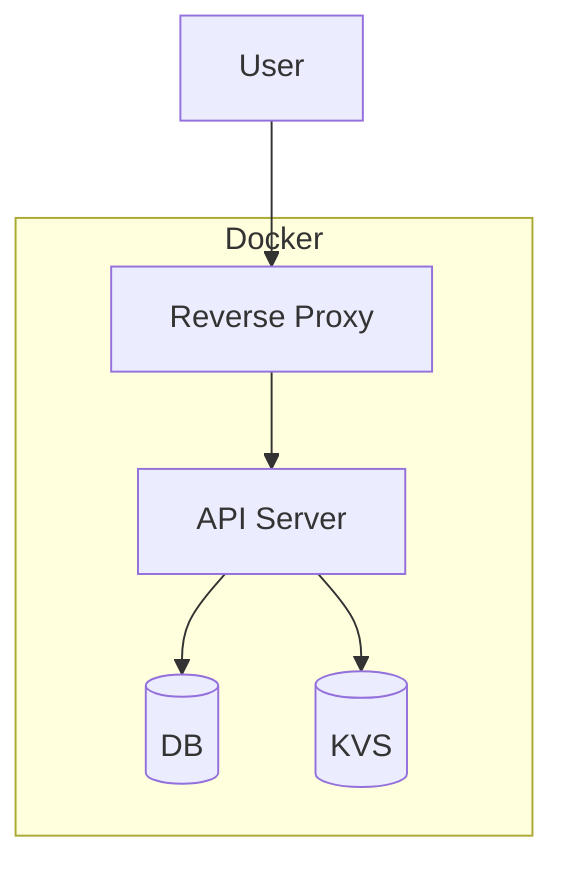
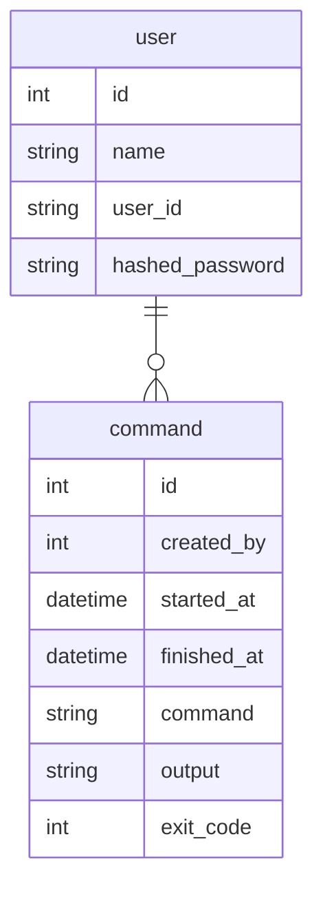

# コンテナ構成

```mermaid
flowchart TD
  u[User] --> reverse[Reverse Proxy]
  subgraph Docker
    reverse --> api[API Server]
    api --> db[(DB)]
    api --> kvs[(KVS)]
  end
```

# ER図

```mermaid
erDiagram
  user ||--o{ command : ""
  user {
    int id
    string name
    string user_id
    string hashed_password
  }
  command {
    int id
    int created_by
    datetime started_at
    datetime finished_at
    string command
    string output
    int exit_code
  }
```

# API

作成中

# シーケンス図

作成中
